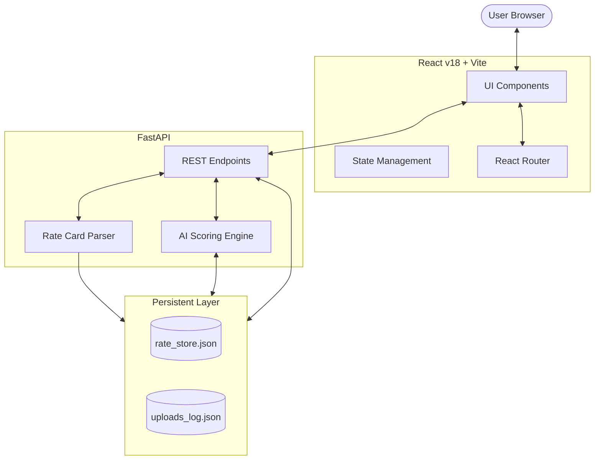

# NexLogis.ai | AI-Powered Courier Rate Aggregator

NexLogis.ai is a premium, industrial-grade logistics platform that aggregates and compares courier rates across Pakistan using an AI scoring engine. It allows businesses to find the optimal shipping path based on cost, speed, and reliability.

## 🏗 System Architecture



## 📂 Project Structure

```text
c:\MLOps Project\
├── api\                # FastAPI backend source code
│   ├── main.py         # Main entry point & AI Logic
│   └── rate_store.json # Persistent JSON database
├── tools\              # Utility scripts & maintenance tools
│   └── generate_dummies.py # Test data generator
├── test_rate_cards\    # Sample files for upload testing (.xlsx, .pdf)
├── venv\               # Active Python virtual environment
├── web_app\            # React/TypeScript frontend (Vite)
│   ├── src/            # Application source
│   ├── public/         # Static assets & Favicon
│   └── index.html      # Entry document
├── README.md           # Documentation
└── requirements.txt    # Python dependencies
```

## 🛠 Tech Stack

- **Frontend**: React 18, TypeScript, Vite, Lucide Icons, Vanilla CSS (Glassmorphism).
- **Backend**: FastAPI (Python), Pandas (Data Processing), PDFPlumber (PDF Extraction), Uvicorn.
- **Data**: JSON-based persistent store for rates and upload logs.

## 🏁 Getting Started

### 1. Prerequisites
- Python 3.13+
- Node.js 20+

### 2. Backend Setup
```bash
# Create and activate virtual environment
python -m venv venv
.\venv\Scripts\activate

# Install dependencies
pip install -r requirements.txt

# Start the API server
uvicorn api.main:app --host 0.0.0.0 --port 8000 --reload
```

### 3. Frontend Setup
```bash
cd web_app
npm install
npm run dev
```

---

## 🚀 CI/CD & Deployment Plan

### 1. Version Control & CI (GitHub Actions)
- **Branch Strategy**: `main` for production, `develop` for feature integration.
- **CI Workflow**: 
    - Triggered on every pull request to `main`.
    - **Linting**: Run `eslint` for frontend and `flake8` for backend.
    - **Testing**: Run `pytest` for AI scoring logic.
    - **Build**: Verify `npm run build` completes without errors.

### 2. Containerization (Docker)
To ensure environment parity, we recommend Dockerizing the stack.
- **Backend Image**: Python 3.13-slim based image.
- **Frontend Image**: Multi-stage build (Node for build, Nginx for serving).

### 3. Deployment Strategy
- **Option A (PaaS - Recommended for Ease)**:
    - **Frontend**: Deploy to **Vercel** or **Netlify** (automatic CI/CD from GitHub).
    - **Backend**: Deploy to **Railway.app** or **Render** with a persistent disk volume for `rate_store.json`.
- **Option B (VPS - Recommended for Control)**:
    - Deploy using **Docker Compose** on a Linux VPS (DigitalOcean/AWS).
    - Use **Nginx** as a reverse proxy with **Let's Encrypt** (Certbot) for SSL.

### 4. Data Persistence
Since the app uses a JSON store, a **Persistent Volume Claim (PVC)** or a mapped host directory is required in production to ensure rate data survives container restarts.

---
© 2026 NexLogis Industrial Systems. All rights reserved.
